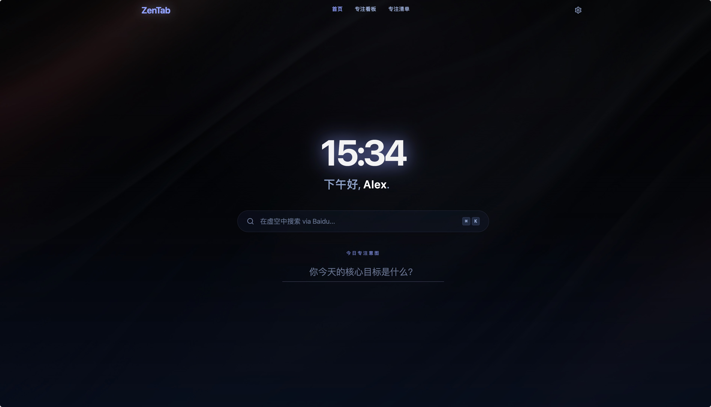

# ZenTab


ZenTab 是一个极简、美观的浏览器新标签页，旨在帮助您保持专注并找到内心的宁静。它在您的浏览器中提供了一个宁静的避风港，用一个整洁、功能强大的仪表盘取代了繁杂的默认新标签页。

## 🧩 安装

[从 Chrome Web Store 安装 ZenTab](https://chromewebstore.google.com/detail/zentab/podnhfddiedpalpoelnjdgflpnhclepp)

## 🖥️ 界面预览

<!-- 如果您在 assets 目录下存有正式的截图，可将其替换为 ./assets/preview.png -->

|                          PC                           |                     Tablet                      |                     Mobile                      |
| :---------------------------------------------------: | :---------------------------------------------: | :---------------------------------------------: |
|  |  |  |

## ✨ 核心特性

- **壁纸美学：** 选择精心挑选的风景图，或设置自定义图片 URL，打造个性化工作区。
- **专注仪表盘：** 采用 Bento（便当盒）网格布局，包含：
  - **番茄钟计时器：** 通过内置的专注时间块提升工作效率。
  - **气象视界：** 实时本地化天气数据及逐小时预报。
  - **快捷链接：** 将最常用的网站进行极简整理，实现快速访问。
- **任务管理：** 整合本地优先的待办事项列表，无需离开新标签页即可追踪每日目标。
- **标签页管理：** 新增浏览器标签页工作台，可按域名自动分组当前打开的标签页，创建手动工作区，批量打开/关闭分组，并将页面保存到“稍后阅读”。
- **可配置启动页：** 支持设置新标签页默认打开 Home、Dashboard、Tasks 或 Tabs，并可选择标签页分组是否默认展开。
- **扩展自动更新：** 商店版扩展会由 Chrome 自动更新；当 Chrome 已发现新版时，可在“关于”页点击“立即更新”应用更新。
- **隐私优先 (本地存储)：** 所有数据（设置、任务、快捷链接、手动工作区和稍后阅读）都安全地存储在浏览器本地。无账号、无数据追踪、不依赖任何外部数据库。
- **多语言支持：** 完美支持英文（English）和简体中文。

## 🛠️ 技术栈

- **框架：** React 18
- **样式：** Tailwind CSS
- **图标：** Lucide React
- **动画：** Framer Motion
- **构建工具：** Vite

## 🚀 本地运行开发

克隆仓库并运行项目以进行本地开发：

```bash
# 1. 安装项目依赖
npm install

# 2. 启动开发服务器
npm run dev
```

## 🧩 本地开发安装

ZenTab 可以在基于 Chromium 的浏览器（Chrome、Edge、Brave 等）中加载本地构建版本，方便开发和验证。

### 安装步骤：

1. **构建扩展**：
   首先，运行以下命令编译生产版本：

   ```bash
   npm run build
   ```

   这会自动生成一个 `dist` 文件夹，其中包含编译好的应用以及用于扩展的 `manifest.json` 文件。

2. **加载到浏览器**：
   - 打开浏览器并前往“扩展程序”管理页面（在地址栏输入 `chrome://extensions` 或 `edge://extensions`）。
   - 开启右上角的 **“开发者模式”**。
   - 点击 **“加载已解压的扩展程序”**。
   - 选择在第 1 步中生成的 `dist` 文件夹。

3. **开始使用**：
   打开一个新标签页，您将看到 ZenTab 的精美界面！
   _(注：某些浏览器可能会提示您是否要保留新标签页的更改，点击“保留”以生效)_

## ⚙️ 个性化设置

您可以通过内置的设置面板（点击左下角的 ⚙️ 图标）获得深度配置：

- 设置自定义背景壁纸 URL。
- 调整全局字体缩放比例，适应不同的显示器。
- 切换应用语言环境。
- 在“关于”页查看当前版本，并在 Chrome 已发现新版本时立即更新扩展。
- 随时一键重置，将所有配置和数据恢复为初始默认状态。

## 📦 发布自动化

Chrome Web Store 自动发布说明见 [docs/release.md](docs/release.md)。

## 友情链接

[Linuxdo社区](https://linux.do)

## 📄 许可证

[MIT 协议](https://opensource.org/licenses/MIT)
